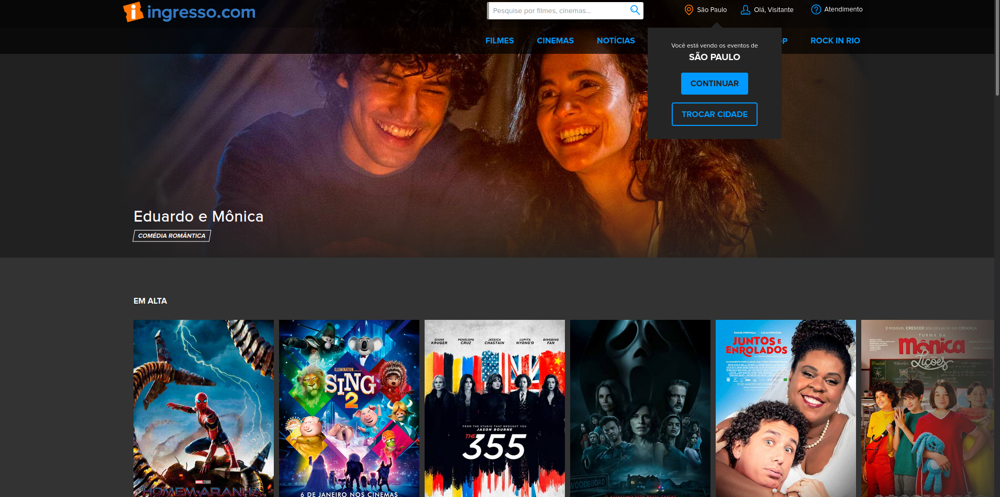

# Introdução

Olá a todos. Navegando por esse mar que é a internet, me deparei com o video de um sujeito chamado <b> Fábio Akita</b>.

Bem, o <a href="https://www.youtube.com/watch?v=0TMr8rsmU-k"> video </a> eu deixo para vocês.

# Front-end

## Requisitos

### Gerais

- Usuário deve ser capaz de logar na aplicação
- Usuário deve ser capaz de selecionar seu Estado

### Home Page

- Deve monstrar logo, filmes em cartaz, seu estado, botão de login
- Mostrar filmes POR ESTADO

### Página do Filme

- DEve mostrar título,foto, aprovação, duração, capa, trailer, detalhes, compartilhar
- Deve ser possível ver os horários disponíveis

### Checkout

- Usuário (logado) deve ser capaz de escolher assento, tipo de ingresso, se quer pipoca ou não, e meio de pagamento

## Páginas (Ingresso.com)

## Tabelas (Banco de Dados)
